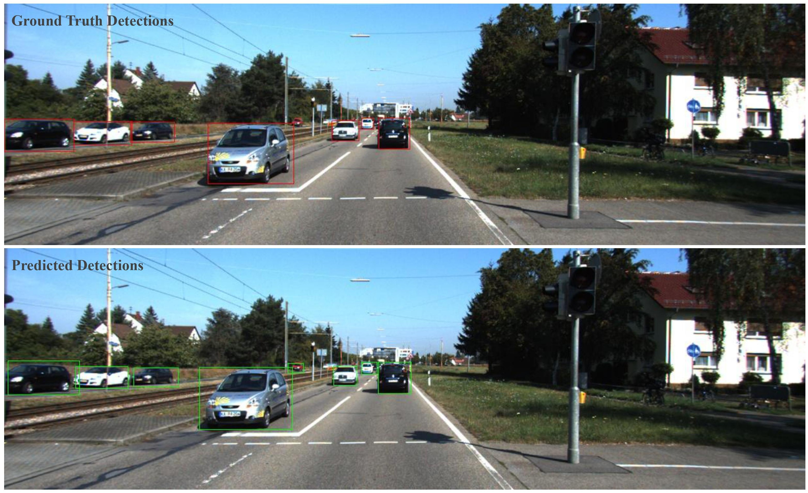

## CenterNet Detection on KITTI

## Overview

This project implemented CenterNet for 2D object detection and tested on [KITTI dataset](http://www.cvlibs.net/datasets/kitti/eval_object.php?obj_benchmark=2d). This is our final project for CS 496 Deep Learning, Fall 2020, Northwestern University.

Checkout my [portfolio post](https://shangzhouye.tech/other-projects/centernet_detection/) for more information on this project.

### Example Output



> *Bounding box detection result of an image in the KITTI dataset*


> *Predicted heatmap of object center points on an image from the validation set.*

We aimed to reproduce the results as what is presented in the original [CenterNet](https://arxiv.org/pdf/1904.07850.pdf) paper. The model represents each object as a single point - the center point of the 2D bounding box. DLA-34 is used as our backbone for center point estimation, and other object properties including width and length of the bounding box are regressed from the center point. We achieved 92.10% Average Precision (AP) for easy objects, 86.72% AP for moderate objects and 78.73% AP for hard objects respectively when detecting cars.

## File Structure

```
├── centernet-vanilla
│   ├── dataset.py
│   ├── DLAnet.py
│   ├── loss.py
│   ├── predict.py
│   ├── train.py
│   └── utils.py
├── dataset_split
│   ├── train.txt
│   └── val.txt
├── environment.yml
├── KITTI_3D_bounding_box.ipynb
├── KITTI_eval.ipynb
└── KITTI_get_item.ipynb
```

This repository was developed and tested in PyTorch 1.6.

## How to run

- Intall required dependencies as listed in [environment.yml](./environment.yml)
- Modify KITTI dataset directory in centernet-vanilla/dataset.py
- Run [train.py](centernet-vanilla/train.py) for training and [predict.py](centernet-vanilla/predict.py) for inference

## Training and Testing


> *Network architecture with three heads - heatmap head, offset head and width-height head.*


**Implementation details:** We use the 34-layer deep layer aggregation (DLA) network as our backbone. The heatmap from the keypoint estimator has the size of 128 x 128 with an output stride of 4. There is an additional local offset prediction to compensate for the decrease in resolution. The weights of heatmap loss, width/height loss and offset loss are 1, 0.1, and 0.1 respectively. We trained with batch-size of 8 (on 1 GPU) and learning rate of 5e-4. The model converges after 3 epochs and start to over-fitting after that.

We use the KITTI Vision Benchmark Suite. It consists of 7481 training images and 7518 test images, comprising a total of 80256 labeled objects. For this project, we focus on object detection for cars only. Because only those 7481 training images have publicly available labels, we random split them into training and validation sets. The training set is 80% of the whole dataset (5984 images) while the validation is 20% of the whole dataset (1497 images). No data augmentation is utilized for our project.

For the evaluation, we followed the standard average precision (AP) evaluation criteria proposed in the Pascal VOC benchmark. A car detection can be counted as true positive only if its overlap with the ground truth bounding box is above 70%. By adjusting the confidence threshold for detection, a precision-recall (PR) curve can be obtained with 40 different recall positions. The AP can then be calculated as the area under the PR curve. We use this calculated average precision value as the measure of the performance of our system.

## Results


> *Compare evaluation results of our implementation to the original CenterNet on KITTI.*

Table above shows our evaluation results compared to the original CenterNet paper. Notice that the original paper follows a 50/50 training and validation split and we are having an 80/20 split. Also, the results of the original paper is based on all classes but we only focused on cars predictions in this project.


> *An example image in the validation set. (left) Ground truth (right) inference results from our implementation.*


> *(left) Ground truth (right) Predicted heatmap. (bottom) Inference results.*

Figure above shows an example inference result compared to the ground truth. It is shown that our model to able to predict most of the objects correctly in this scene. The comparison between the ground truth heatmap with Gaussian smoothing and our predicted heatmap on the same image is also shown on the image above.


> *Precision Recall curve on validation set.*

Figure above shows the precision-recall curve of our final model on the validation set. Three curves represent easy, moderate, and hard objects respectively. The area under the curve is the average precision (AP).

## Acknowledgement

We used the DLA-34 network, loss functions and some other functions from this [R-CenterNet repo](https://github.com/ZeroE04/R-CenterNet).